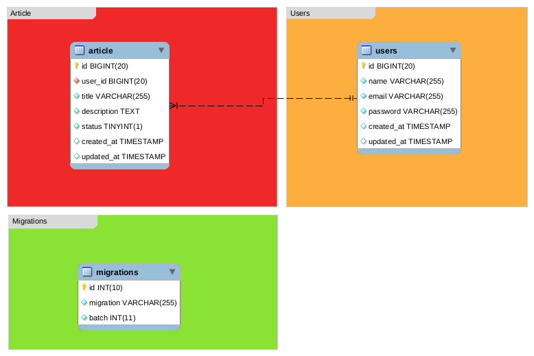

# Simple API using Laravel Lumen

This project is based on the youtube tutorials [Building a API with Lumen - A PHP framework](https://www.youtube.com/watch?v=6Oxfb_HNY0U) and [Laravel RESTFul API with JSON Web Token JWT](https://www.youtube.com/watch?v=jF9wdF0sViI).

It's using [Lumen PHP Framework](https://lumen.laravel.com/).

## Database Model

The model is like a 'blueprint' that presents the representation of the entities that make up the database with their properties, relationships, restrictions, etc.



# Settings

The files that must be changed for the system to be configured on the server are:

- Rename the file [.env.example](https://github.com/julianomacielferreira/laravel-api/blob/main/.env.example) to **.env**

```bash
APP_NAME=Simple_Laravel_API
APP_ENV=local
APP_KEY=1a4bebaa89c41869df6290fa928db22b
APP_DEBUG=true
APP_URL=http://localhost
APP_TIMEZONE=UTC

LOG_CHANNEL=stack
LOG_SLACK_WEBHOOK_URL=

DB_CONNECTION=mysql
DB_HOST=127.0.0.1
DB_PORT=3306
DB_DATABASE=laravel_api
DB_USERNAME=laravel
DB_PASSWORD=password

CACHE_DRIVER=file
QUEUE_CONNECTION=sync
```

All the configuration opotions above should be different in your environment (see [Laravel Docs](https://lumen.laravel.com/docs/8.x) to know more about).

To generate a random **APP_KEY** just run the command on terminal:

```bash
$ php -r "echo md5(uniqid()).\"\n\";"
```

and copy the output.

# Docker

**[Docker](https://docs.docker.com/install/) and [Docker Compose](https://docs.docker.com/compose/install/) must be installed.**

First create a directory called **data** in the root project folder:

```bash
$ mkdir -p docker/mysql/data
```

Again, in the root project folder, build the image and fire up the container:

```bash
$ docker-compose up -d --build
```

Or simple run the [docker-start.sh](https://github.com/julianomacielferreira/laravel-api/blob/main/docker-start.sh) script:

```bash
$ ./docker-start.sh
```

Obs.: If the script is not executable, run:

```bash
$ chmod +x docker-start.sh
```

To stop the container before moving on:

```bash
$ docker-compose stop
```

See the [references section](#references) to know more or take a look at [MySQL Docker Documentation](https://docs.docker.com/samples/library/mysql/).

# Runing the App

In the root project folder install composer packages:

```bash
$ composer install
```

In the root project folder start up the project:

```bash
$ php -S localhost:8080 -t public
```

And then access [http://localhost:8080/](http://localhost:8080/) on your browser.

# Enpoints

### List all Articles (GET): 

- **/api/articles**

Example:

```bash
$ curl http://localhost:8080/api/articles/
```

The output:

```json
[
    {
        "idArticle":1,
        "title":"Title",
        "description":"Description",
        "status":1,
        "created_at":"2020-11-04T15:12:49.000000Z",
        "updated_at":"2020-11-04T15:12:49.000000Z"
    },{
        "idArticle":2,
        "title":"Title",
        "description":"Description",
        "status":1,
        "created_at":"2020-11-04T15:12:50.000000Z",
        "updated_at":"2020-11-04T15:12:50.000000Z"
    }
]
```

### Retrieve an Article (GET):

- **/api/articles/{id}**
- **id**: number representing the primary key

Example:

```bash
$ curl http://localhost:8080/api/articles/1
```

The output:

```json
[
    {
        "idArticle":1,
        "title":"Title",
        "description":"Description",
        "status":1,
        "created_at":"2020-11-04T15:12:49.000000Z",
        "updated_at":"2020-11-04T15:12:49.000000Z"
    }
]
```

### Create an Article (POST): 

- **/api/articles**

Example:

```bash
$ curl -d '{"title":"Title New","description":"Description New","status":1}' \
-H "Content-Type: application/json" \
-X POST http://localhost:8080/api/articles
```

The output:

```json
{
    "title":"Title New",
    "description":"Description New",
    "status":"1",
    "updated_at":"2020-11-04T20:17:38.000000Z",
    "created_at":"2020-11-04T20:17:38.000000Z"
}
```

### Update an Article (PUT): 

- **/api/articles/{id}**
- **id**: number representing the primary key

Example:

```bash
$ curl -d '{"idArticle":1, "title":"Title Updated","description":"Description Updated","status":1}' \
-H "Content-Type: application/json" \
-X PUT http://localhost:8080/api/articles/19
```

The output:

```json
{
    "idArticle":1,
    "title":"Title Updated",
    "description":"Description Updated",
    "status":"1",
    "updated_at":"2020-11-04T20:17:38.000000Z",
    "created_at":"2020-11-04T20:17:38.000000Z"
}
```

### Delete an Article (DELETE): 

- **/api/articles/{id}**
- **id**: number representing the primary key

Example:

```bash
$ curl -X DELETE http://localhost:8080/api/articles/19
```

The output:

```bash
Deleted successfully
```

## Lumen PHP Framework

[](https://travis-ci.org/laravel/lumen-framework)
[](https://packagist.org/packages/laravel/lumen-framework)
[](https://packagist.org/packages/laravel/lumen-framework)
[](https://packagist.org/packages/laravel/lumen-framework)

Laravel Lumen is a stunningly fast PHP micro-framework for building web applications with expressive, elegant syntax. We believe development must be an enjoyable, creative experience to be truly fulfilling. Lumen attempts to take the pain out of development by easing common tasks used in the majority of web projects, such as routing, database abstraction, queueing, and caching.

## Official Documentation

Documentation for the framework can be found on the [Lumen website](https://lumen.laravel.com/docs).

## Contributing

Thank you for considering contributing to Lumen! The contribution guide can be found in the [Laravel documentation](https://laravel.com/docs/contributions).

## Security Vulnerabilities

If you discover a security vulnerability within Lumen, please send an e-mail to Taylor Otwell at taylor@laravel.com. All security vulnerabilities will be promptly addressed.

## License

The Lumen framework is open-sourced software licensed under the [MIT license](https://opensource.org/licenses/MIT).

## References

- [Laravel](https://laravel.com/)
- [The Lumen framework](https://lumen.laravel.com/)
- [vendor:publish for Lumen framework](https://github.com/laravelista/lumen-vendor-publish)
- [JSON Web Token Authentication for Laravel & Lumen](https://jwt-auth.readthedocs.io/en/develop/)
- [MySQL](https://mysql.com)
- [Docker](https://www.docker.com/)
- [Docker Compose](https://docs.docker.com/compose/install/)